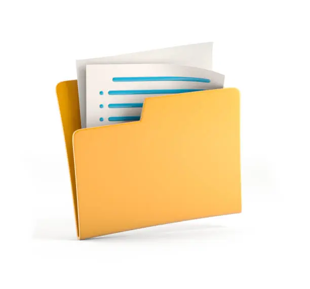

# 🌐 My Portfolio Website

A sleek, responsive, and modern personal portfolio website built with **HTML, CSS, and JavaScript**.  
This project showcases my **skills, projects, and contact information** in a clean, professional design with support for **light and dark modes**.

---

## ✨ Features

- 🎨 Modern and minimal UI design
- 📱 Fully responsive (mobile, tablet, desktop)
- 🌙 Light & Dark mode toggle
- 🖼️ Dedicated project detail pages (E-Commerce, Blog, Portfolio)
- 🔗 Direct links to GitHub, LinkedIn, Email, and WhatsApp
- ⚡ Smooth animations and clean layout

---

## 📸 Screenshots

### Homepage  

### Projects  

---

## 🛠️ Tech Stack

- **HTML5**
- **CSS3**
- **JavaScript**
- **Font Awesome** (icons)
- **Devicon** (technology logos)

---

## 🚀 Live Demo

👉 [View Portfolio Live](https://jamal-portfolio.netlify.app)

---

## 📂 Project Structure

portfolio-website/
├── index.html
├── css/
│ └── style.css
├── images/
│ ├── bg.jpg
│ ├── blog.png
│ ├── ecommerce.png
│ └── portfolio.png
├── projects/
│ ├── blog.html
│ ├── ecommerce.html
│ └── portfolio.html
└── README.md

---

## 📬 Contact

💼 LinkedIn: [[linkedin.com/in/jamal-ademola-9b623236b](https://www.linkedin.com/in/jamal-ademola-9b623236b)  
💻 GitHub: [github.com/Jamal-09](https://github.com/Jamal-09)  
📧 Email: [napg.adekunle@gmail.com](mailto:napg.adekunle@gmail.com)  
📱 WhatsApp: [Chat on WhatsApp](https://wa.me/2348148647795)  

---

⭐ If you like this project, don’t forget to **star the repo** and share feedback!
